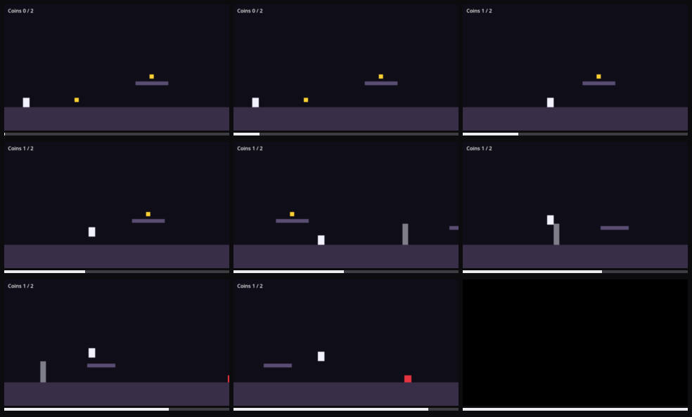

# Game crashes

Severity: blocker
Filed by: playerone (no director)
Incident: #2

## Steps to reproduce

1. Start the game
2. Play forward for about 18s (12 input groups, full list in session.json)
3. tap space
4. hold right
5. hold left
6. hold right (x3)
7. tap space
8. hold right (x3)
9. hold left
10. tap space
11. The problem shows at about 17.9s

## Actual

game process exited (exit code: 0xc000001d)

## Engine console

```
stderr:    GDScript backtrace (most recent call first):
stderr:        [0] _check_triggers (res://main.gd:153)
stderr:        [1] _physics_process (res://main.gd:131)
stderr: ERROR: spike collision corrupted the player state
stderr:    at: crash (core/core_bind.cpp:349)
stderr:    GDScript backtrace (most recent call first):
stderr:        [0] _check_triggers (res://main.gd:154)
stderr:        [1] _physics_process (res://main.gd:131)
stderr: ================================================================
stderr: CrashHandlerException: Program crashed with signal 4
stderr: Engine version: Godot Engine v4.7.2.stable.official (ed1daf0bf001b61586d9930840f2f1394092c079)
stderr: Dumping the backtrace. Please include this when reporting the bug on: https://github.com/godotengine/godot/issues
stderr: Load address: 7ff50e2a0000
stderr: -- END OF C++ BACKTRACE --
stderr: ================================================================
stderr: GDScript backtrace (most recent call first):
stderr:     [0] _check_triggers (res://main.gd:154)
stderr:     [1] _physics_process (res://main.gd:131)
stderr: -- END OF GDSCRIPT BACKTRACE --
stderr: ================================================================
```



Clip: ../incident-002.mp4
