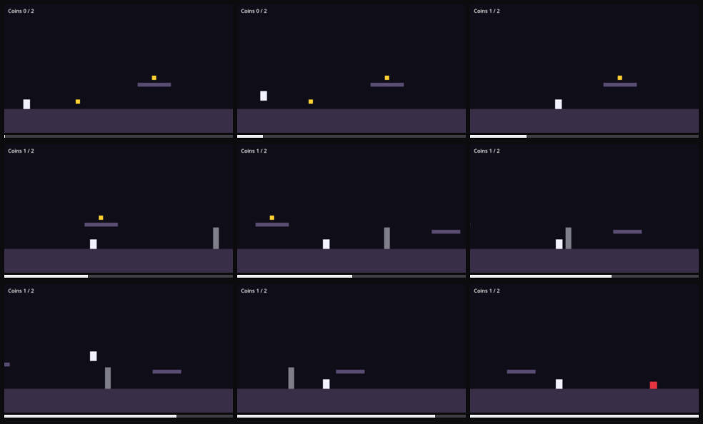

# Engine error: SCRIPT ERROR: Invalid call. Nonexistent function 'open' in base 'Nil'.

Severity: major
Filed by: playerone (no director)
Incident: #1

## Steps to reproduce

1. Start the game
2. hold right
3. tap space
4. hold right (x4)
5. hold left
6. tap space
7. hold right (x3)
8. tap space
9. hold right
10. hold space (x2)
11. The problem shows at about 12.5s

## Actual

SCRIPT ERROR: Invalid call. Nonexistent function 'open' in base 'Nil'.

## Engine console

```
stdout: Godot Engine v4.7.2.stable.official.ed1daf0bf - https://godotengine.org
stdout: OpenGL API 3.3.0 NVIDIA 610.78 - Compatibility - Using Device: NVIDIA - NVIDIA GeForce RTX 4060 Laptop GPU
stdout: cavern: bugs enabled = ["error"]
stdout: cavern: coin picked, coins=1
stderr: SCRIPT ERROR: Invalid call. Nonexistent function 'open' in base 'Nil'.
stderr:    at: _check_triggers (res://main.gd:148)
stderr:    GDScript backtrace (most recent call first):
stderr:        [0] _check_triggers (res://main.gd:148)
stderr:        [1] _physics_process (res://main.gd:131)
```



Clip: ../incident-001.mp4
