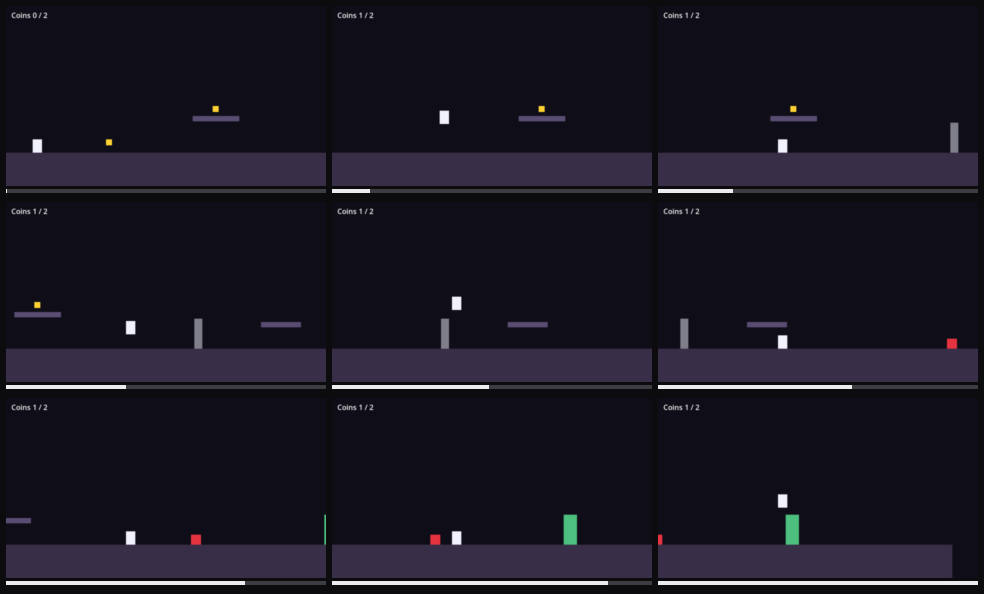

# Game hangs: the window stops drawing

Severity: blocker
Filed by: playerone (no director)
Incident: #1

## Steps to reproduce

1. Start the game
2. Play forward for about 20s (18 input groups, full list in session.json)
3. hold left
4. tap space
5. hold right (x2)
6. hold space
7. hold right
8. tap space
9. hold right (x4)
10. tap space
11. The problem shows at about 20.4s

## Actual

the game window stopped drawing: no frame for 4s and it does not answer paint requests

## Engine console

```
stdout: Godot Engine v4.7.2.stable.official.ed1daf0bf - https://godotengine.org
stdout: OpenGL API 3.3.0 NVIDIA 610.78 - Compatibility - Using Device: NVIDIA - NVIDIA GeForce RTX 4060 Laptop GPU
stdout: cavern: bugs enabled = ["freeze"]
stdout: cavern: coin picked, coins=1
stdout: cavern: opening door
```



Clip: ../incident-001.mp4
