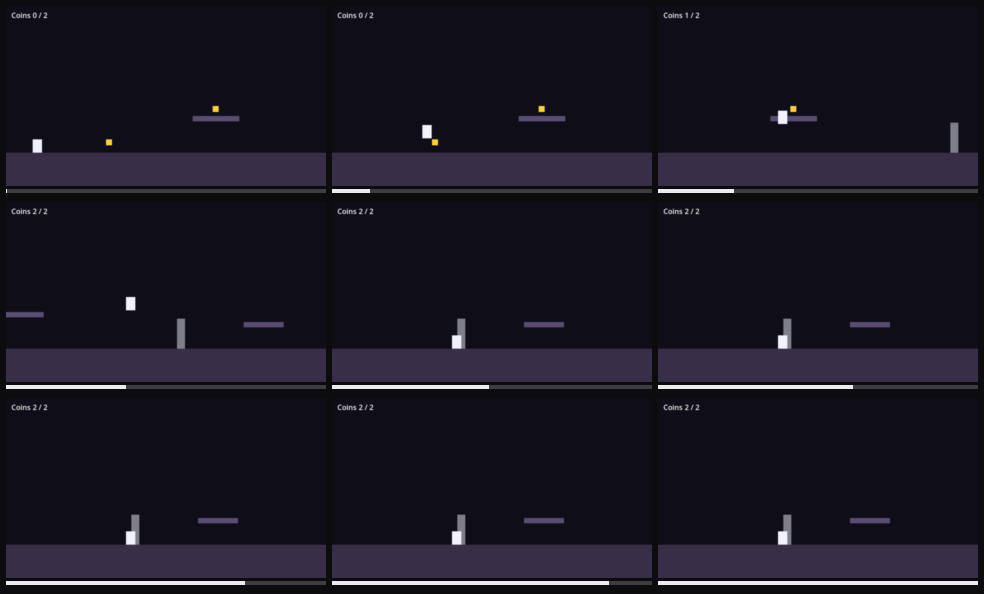

# Player gets soft-locked: no control has any effect

Severity: blocker
Filed by: playerone (no director)
Incident: #1

## Steps to reproduce

1. Start the game
2. Play forward for about 15s (8 input groups, full list in session.json)
3. hold right (x6)
4. hold space
5. hold left
6. tap space
7. hold right
8. hold left
9. tap space
10. hold right
11. The problem shows at about 15.0s

## Actual

the player is stuck: the screen stayed still for 4s of input and no control had any effect when probed

## Engine console

```
stdout: Godot Engine v4.7.2.stable.official.ed1daf0bf - https://godotengine.org
stdout: OpenGL API 3.3.0 NVIDIA 610.78 - Compatibility - Using Device: NVIDIA - NVIDIA GeForce RTX 4060 Laptop GPU
stdout: cavern: bugs enabled = ["softlock"]
stdout: cavern: coin picked, coins=1
stdout: cavern: coin picked, coins=2
```



Clip: ../incident-001.mp4
