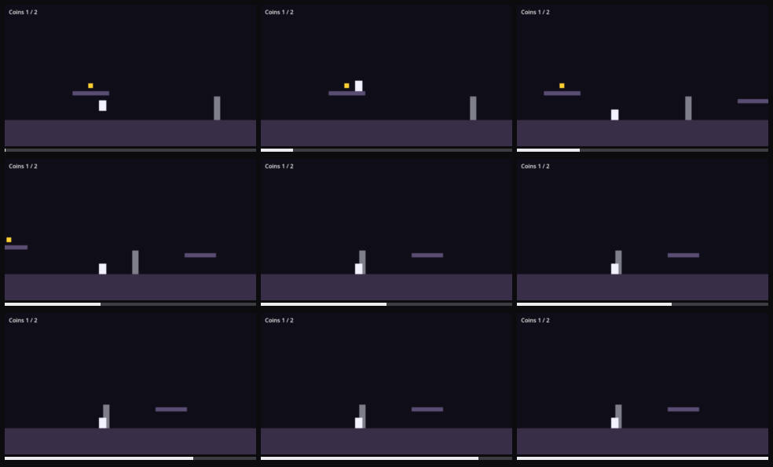

# Player gets soft-locked: no control has any effect

Severity: blocker
Filed by: playerone (no director)
Incident: #1

## Steps to reproduce

1. Start the game
2. hold right (x5)
3. hold left
4. hold right
5. hold left (x2)
6. hold right (x5)
7. hold left
8. hold right (x3)
9. The problem shows at about 38.9s

## Actual

the player is stuck: the screen stayed still for 4s of input and no control had any effect when probed

## Engine console

```
stdout: Godot Engine v4.7.2.stable.official.ed1daf0bf - https://godotengine.org
stdout: OpenGL API 3.3.0 NVIDIA 610.78 - Compatibility - Using Device: NVIDIA - NVIDIA GeForce RTX 4060 Laptop GPU
stdout: cavern: bugs enabled = ["softlock"]
stdout: cavern: coin picked, coins=1
```



Clip: ../incident-001.mp4
